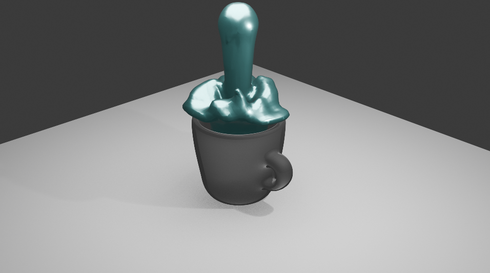

# Blender Fluid Simulation

Blender kullanılarak geliştirilen bir sıvı simülasyonu ve 3D görselleştirme projesidir.

## Proje Hakkında

Bu projede Blender'ın sıvı simülasyonu sistemi kullanılarak bir kap içerisindeki akışkan hareketi modellenmiş ve görselleştirilmiştir.

## Proje Özellikleri

- Fluid simulation
- Liquid domain oluşturma
- Simülasyon cache ve bake işlemleri
- 3D modelleme
- Malzeme ve yüzey çalışmaları
- Aydınlatma
- Kamera yerleşimi
- Render alma

## Kullanılan Teknoloji

- Blender

## Render

## Geliştirici

### Ecem Özen

Computer Engineering Student

Zonguldak Bülent Ecevit University
